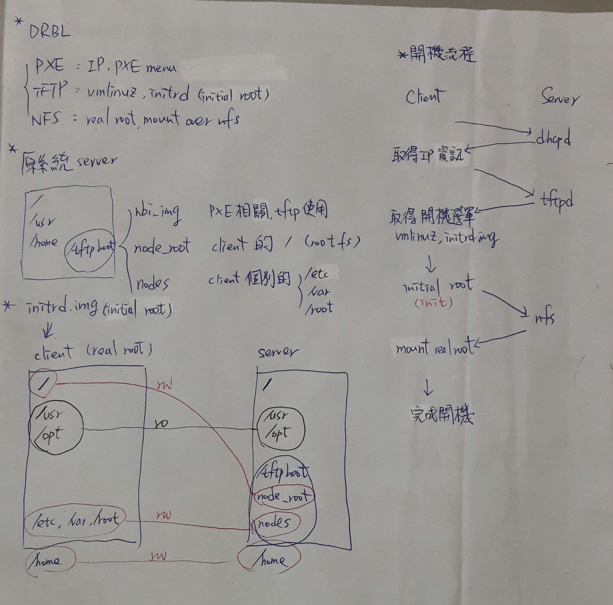

# chps-dhcpd-pxe
dhcpd and PXE boot config files for CHPS

  - [SystemRescueCd](https://www.system-rescue-cd.org/)
  - [FreeDOS](http://www.freedos.org/)
  - [Clonezilla](http://clonezilla.nchc.org.tw/)
  - Ghost
  - [Memtest86+](http://www.memtest.org/)
  - [Offline Windows Password & Registry Editor](http://pogostick.net/~pnh/ntpasswd/)
  - [Super Grub2 Disk](http://www.supergrubdisk.org/super-grub2-disk/)
  - [HDT](http://www.hdt-project.org/)
  - [GAG (initials, in spanish, of Graphical Boot Manager)](http://gag.sourceforge.net/)
  - [DBAN](http://www.dban.org/)
  - [Fedora](https://getfedora.org/)
  
## Ubuntu Create Floppy Image
  - [Ubuntu Create Floppy Image](http://www.richud.com/wiki/Ubuntu_Create_Floppy_Image)
  
## LiveCDCustomization (Rebuilding initrd)
  - [LiveCDCustomization](https://help.ubuntu.com/community/LiveCDCustomization#Rebuilding_initrd)

## About DRBL booting process
  - 
